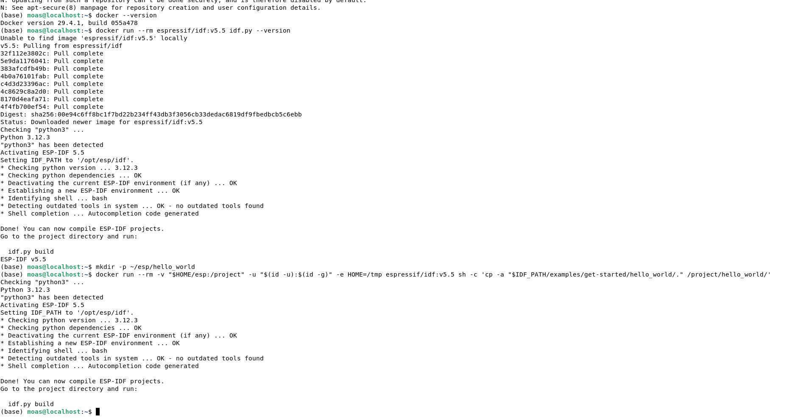
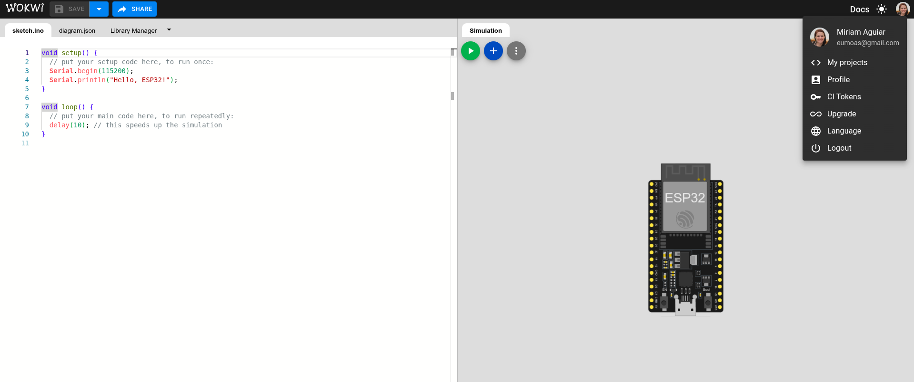
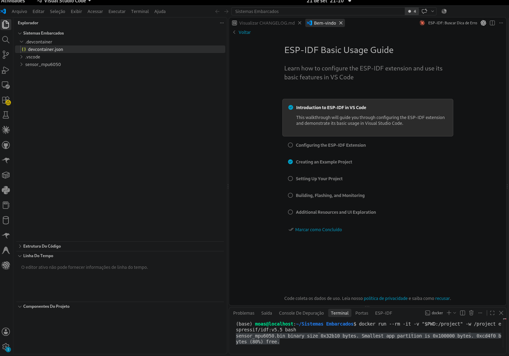
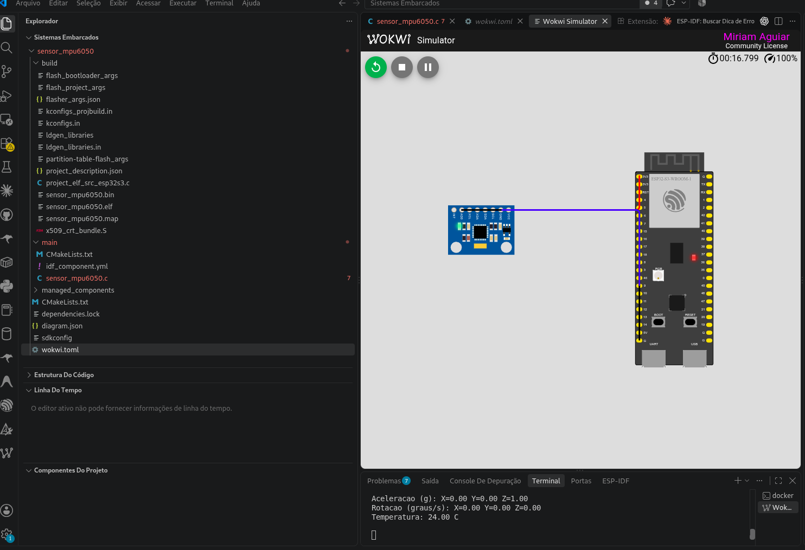
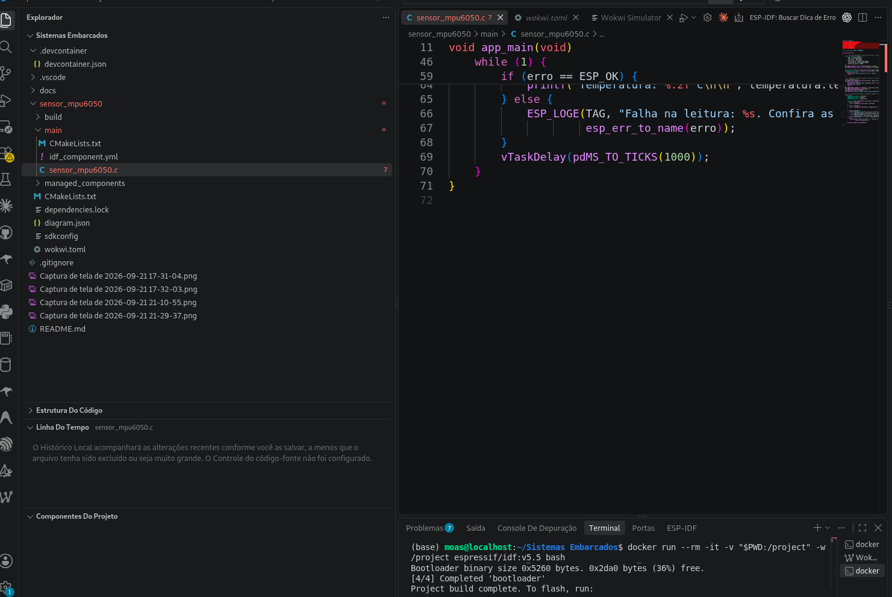

# Leitura do MPU6050 com ESP32-S3, ESP-IDF e Wokwi

Projeto da disciplina de **Sistemas Embarcados**: desenvolvimento de um programa em **C**, usando o **ESP-IDF 5.5**, para inicializar um sensor **MPU6050** e apresentar suas leituras no monitor serial de uma simulação executada no **Wokwi para VS Code**.

O programa lê aceleração nos eixos X, Y e Z, velocidade angular nos três eixos e temperatura interna do sensor. Após cada conjunto de leituras, aguarda um segundo antes de repetir o processo.

**Resultado validado:** compilação para ESP32-S3 concluída e leituras exibidas no monitor serial do Wokwi. O circuito foi testado em simulação; não foi realizado ensaio em uma placa física.

**Repositório:** [eumoas/sistemaembarcado-leituradesensor](https://github.com/eumoas/sistemaembarcado-leituradesensor).

## Sumário

- [1. Objetivo e requisitos](#1-objetivo-e-atendimento-aos-requisitos)
- [2. Estrutura dos arquivos](#2-estrutura-dos-arquivos)
- [3. Sensor e circuito](#3-sensor-escolhido-e-circuito)
- [4. Configuração do ambiente](#4-configuração-do-ambiente)
- [5. Compilação](#5-compilar-o-firmware)
- [6. Explicação do código](#6-explicação-do-código-em-c)
- [7. Simulação no VS Code](#7-executar-a-simulação-no-vs-code)
- [8. Resultados](#8-resultados-e-interpretação)
- [9. Evidências](#9-evidências-da-atividade)
- [10. Dificuldades e soluções](#10-dificuldades-encontradas-e-soluções)
- [11. Referências](#11-referências-técnicas)

## 1. Objetivo e atendimento aos requisitos

O objetivo é integrar a configuração do ambiente de desenvolvimento, a montagem de um circuito virtual, a utilização de uma biblioteca de sensor e a execução de um firmware em C.

| Requisito da atividade | Implementação neste projeto | Onde verificar |
|---|---|---|
| Configurar o ESP-IDF e a conta Wokwi | ESP-IDF 5.5 executado em Docker; licença Wokwi ativada no VS Code | Seção 4 e evidências da seção 9 |
| Escolher um sensor disponível no Wokwi | MPU6050: acelerômetro, giroscópio e temperatura interna | Seção 3 |
| Conectar o sensor ao ESP32-S3 | Alimentação de 3,3 V, GND, SDA e SCL | Seção 3.2 e `sensor_mpu6050/diagram.json` |
| Inicializar o sensor conforme a biblioteca | Criação do objeto, verificação de identificação, configuração das escalas e saída do modo de repouso | Seção 6 e código em C |
| Implementar em C | Função `app_main()` e laço contínuo de aquisição | `sensor_mpu6050/main/sensor_mpu6050.c` |
| Executar no VS Code e registrar as leituras | Wokwi utiliza o firmware compilado pelo ESP-IDF | Screenshot da seção 9 |

Os pesos informados na atividade são: **50%** para configuração do ESP-IDF e da conta Wokwi, **20%** para o circuito, **20%** para compilação e **10%** para inicialização e leitura do sensor.

## 2. Estrutura dos arquivos

```text
.
├── README.md
├── .gitignore
├── .devcontainer/
│   └── devcontainer.json          # Configuração opcional de Dev Container
├── docs/
│   ├── EVIDENCIAS.md              # Orientação para registrar cada etapa
│   └── imagens/
│       ├── 01-esp-idf-configurado.png
│       ├── 02-wokwi-configurado.png
│       ├── 03-compilacao-inicial.png
│       ├── 03-compilacao-concluida.png
│       └── 04-simulacao-monitor-serial.png
└── sensor_mpu6050/
    ├── CMakeLists.txt             # Define o projeto ESP-IDF
    ├── sdkconfig                  # Configuração usada na compilação
    ├── dependencies.lock          # Versões resolvidas das dependências
    ├── diagram.json               # Placa, sensor e conexões do circuito
    ├── wokwi.toml                 # Caminhos do firmware para o simulador
    └── main/
        ├── CMakeLists.txt         # Registra o código e suas dependências
        ├── idf_component.yml      # Declara a biblioteca MPU6050
        └── sensor_mpu6050.c       # Programa principal, comentado em etapas
```

As pastas `build/` e `managed_components/` são geradas durante a compilação e estão no `.gitignore`. A primeira contém o firmware e os arquivos intermediários; a segunda contém a biblioteca baixada pelo gerenciador de componentes. Ambas podem ser recriadas a partir dos arquivos versionados.

## 3. Sensor escolhido e circuito

### 3.1. Por que utilizar o MPU6050?

O MPU6050 reúne um acelerômetro de três eixos e um giroscópio de três eixos, além de permitir a leitura de sua temperatura interna. Está entre as opções indicadas na atividade e está disponível no Wokwi.

Sua comunicação é feita por **I²C**, com duas linhas: **SDA**, para dados, e **SCL**, para o clock que coordena a transmissão. Neste projeto, o ESP32-S3 inicia as operações de leitura e escrita, enquanto o sensor responde ao endereço configurado.

A temperatura apresentada corresponde à medição interna do MPU6050; em um circuito físico, ela não deve ser interpretada automaticamente como uma medição precisa da temperatura ambiente.

### 3.2. Ligações utilizadas

| Pino do MPU6050 | Pino do ESP32-S3 | Função |
|---|---|---|
| VCC | 3V3.1 | Alimentação de 3,3 V |
| GND | GND.1 | Referência elétrica comum |
| SDA | GPIO 8 | Dados do barramento I²C |
| SCL | GPIO 9 | Clock do barramento I²C |
| AD0 | Não conectado | Sem ligação ao VCC, o sensor usa o endereço I²C padrão `0x68` |
| INT | Não conectado | Interrupções não são utilizadas neste programa |
| XDA e XCL | Não conectados | Barramento auxiliar não utilizado |

Os GPIOs 8 e 9 são uma escolha deste projeto e estão declarados explicitamente no código. Não representam uma regra de pinagem fixa para todos os projetos ESP32-S3.

As conexões `esp:TX → $serialMonitor:RX` e `esp:RX → $serialMonitor:TX` permitem a comunicação com o monitor serial virtual. Elas são independentes do I²C do sensor. A configuração do console é **115200 baud**.

O código habilita os pull-ups internos de SDA e SCL, utilizados nesta simulação. Para uma montagem física, seria necessário verificar os pull-ups presentes no módulo e dimensionar o circuito conforme as características elétricas do barramento.

O arquivo [diagram.json](sensor_mpu6050/diagram.json) é a descrição completa e reproduzível das conexões. Os fios seguem trajetos paralelos, sem cruzamentos e sem passar por cima das placas: vermelho para VCC → 3V3, preto para GND → GND, verde para SDA → GPIO 8 e azul para SCL → GPIO 9.

Na primeira versão do circuito, AD0 também estava ligado ao GND. Como AD0 fica à esquerda de SDA e SCL no conector do sensor, e o GND da placa fica abaixo dos GPIOs 8 e 9, essa ligação obrigava um fio a cruzar outro. O fio foi retirado porque a [documentação do Wokwi](https://docs.wokwi.com/parts/wokwi-mpu6050) indica que normalmente basta ligar VCC, GND, SCL e SDA e que o endereço padrão do sensor é `0x68`. AD0 só precisaria ser ligado ao VCC para usar o endereço `0x69`.

### 3.3. Valores iniciais da simulação

| Grandeza | Valor configurado |
|---|---|
| Aceleração X / Y / Z | 0 / 0 / 1 g |
| Velocidade angular X / Y / Z | 0 / 0 / 0 graus/s |
| Temperatura | 24 °C |

Esses valores são atributos do sensor em `diagram.json`. O programa não imprime constantes no lugar das leituras: ele consulta o dispositivo simulado pela biblioteca, usando o barramento I²C.

## 4. Configuração do ambiente

### 4.1. Ferramentas e versões utilizadas

| Ferramenta | Configuração |
|---|---|
| Editor | Visual Studio Code |
| Extensão ESP-IDF | Espressif IDF, instalada no VS Code |
| Ambiente de compilação | Docker, imagem `espressif/idf:v5.5` |
| Framework | ESP-IDF v5.5 |
| Alvo de compilação | `esp32s3` |
| Linguagem da aplicação | C |
| Biblioteca | `espressif/mpu6050`, versão fixa `1.2.0` |
| Simulador | Extensão Wokwi Simulator para VS Code |
| Conta Wokwi | Licença ativada na extensão |
| Flash configurada | 2 MB |

É necessário ter Docker funcionando, acesso à internet para baixar a imagem e a biblioteca, VS Code e as extensões utilizadas. A instalação e a permissão de uso do Docker dependem do sistema operacional.

### 4.2. Obter o projeto

Execute no terminal do Linux:

```bash
git clone https://github.com/eumoas/sistemaembarcado-leituradesensor.git
cd sistemaembarcado-leituradesensor
code .
```

Os comandos seguintes devem partir da raiz do repositório, onde estão este README e a pasta `sensor_mpu6050`.

### 4.3. Abrir o ESP-IDF pelo Docker — caminho utilizado e validado

No terminal integrado do VS Code, na raiz do repositório:

```bash
docker run --rm -it -v "$PWD:/project" -w /project espressif/idf:v5.5 bash
```

| Parte do comando | Significado |
|---|---|
| `docker run` | Cria e inicia um contêiner |
| `--rm` | Remove o contêiner ao encerrar; os arquivos da pasta compartilhada permanecem |
| `-it` | Abre uma sessão de terminal interativa |
| `-v "$PWD:/project"` | Compartilha a pasta atual com `/project` dentro do contêiner |
| `-w /project` | Define a pasta inicial do terminal |
| `espressif/idf:v5.5` | Seleciona a imagem com o ESP-IDF 5.5 |
| `bash` | Abre o interpretador de comandos |

Já dentro do contêiner, confira:

```bash
idf.py --version
```

Resultado obtido no desenvolvimento:

```text
ESP-IDF v5.5
```

O prompt dentro do contêiner costuma ser semelhante a `root@identificador:/project#`. Se o terminal ainda mostrar o usuário e a pasta do computador, o comando `idf.py` pode não existir ali, pois o framework foi instalado no Docker.

O VS Code permanece aberto no computador e o terminal executa a compilação dentro do Docker. Como a pasta é compartilhada, a extensão Wokwi consegue acessar localmente o firmware produzido.

### 4.4. Alternativa: Dev Containers

O arquivo `.devcontainer/devcontainer.json` configura a mesma imagem do ESP-IDF, os caminhos das ferramentas e um perfil de terminal. Ele pode ser usado com **Dev Containers: Reopen in Container**.

Durante o desenvolvimento houve dificuldade de conexão pela interface Dev Containers. Por isso, o procedimento efetivamente validado foi a abertura direta do Docker pelo terminal, descrita acima. A presença desse arquivo não comprova que a integração Dev Containers tenha sido validada de ponta a ponta.

### 4.5. Configurar a conta e a extensão Wokwi

1. Instale a extensão **Wokwi Simulator** no VS Code.
2. Abra a paleta de comandos com **Ctrl + Shift + P**.
3. Execute **Wokwi: Request a New License**.
4. No navegador, entre na conta Wokwi e siga o fluxo **GET YOUR LICENSE**.
5. Autorize o retorno ao VS Code e confira a confirmação de ativação.

A conta e a licença são configuradas individualmente por quem executa o projeto. Não é necessário incluir uma chave de licença nos arquivos do repositório.

## 5. Compilar o firmware

Dentro do terminal Docker, execute:

```bash
cd /project/sensor_mpu6050
idf.py set-target esp32s3
idf.py build
```

`set-target` seleciona o microcontrolador e reconfigura o projeto. Em compilações posteriores, quando o alvo já estiver correto, basta executar `idf.py build`.

O ESP-IDF lê `main/idf_component.yml` e baixa automaticamente a biblioteca declarada:

```yaml
dependencies:
  espressif/mpu6050: "1.2.0"
```

A versão está fixada para reproduzir a configuração validada. No ambiente ESP-IDF 5.5 utilizado, a versão 1.2.1 apresentou falha de compilação relacionada à dependência de `driver/i2c.h`. A versão 1.2.0 foi compilada com sucesso com o código deste projeto.

O resultado da compilação final do código do sensor foi:

```text
sensor_mpu6050.bin binary size 0x380c0 bytes.
Smallest app partition is 0x100000 bytes. 0xc7f40 bytes (78%) free.
Project build complete.
```

O percentual indica espaço livre na menor partição de aplicação, não memória RAM livre. O tamanho do binário pode variar caso código, configuração ou ferramentas sejam alterados.

Principais arquivos gerados:

| Arquivo em `sensor_mpu6050/build/` | Finalidade |
|---|---|
| `sensor_mpu6050.bin` | Firmware da aplicação |
| `sensor_mpu6050.elf` | Executável com informações utilizadas pelas ferramentas |
| `bootloader/bootloader.bin` | Programa responsável pela inicialização |
| `partition_table/partition-table.bin` | Organização das regiões da memória flash |
| `flasher_args.json` | Lista dos arquivos e endereços necessários para carregar o firmware completo |

Não é necessário executar `idf.py flash` para utilizar o Wokwi: a extensão carrega os arquivos compilados no ESP32-S3 virtual.

## 6. Explicação do código em C

O código completo está em [main/sensor_mpu6050.c](sensor_mpu6050/main/sensor_mpu6050.c). Sua entrada é `app_main()`, chamada pelo ESP-IDF após a inicialização do sistema.

### 6.1. Configuração do I²C

A estrutura `i2c_config_t` define o ESP32-S3 como mestre, SDA no GPIO 8, SCL no GPIO 9, pull-ups internos habilitados e frequência de **100 kHz**.

`i2c_param_config()` aplica esses parâmetros à porta `I2C_NUM_0`. Em seguida, `i2c_driver_install()` instala o driver. A biblioteca escolhida utiliza a API I²C legada do ESP-IDF, correspondente ao cabeçalho `driver/i2c.h`.

### 6.2. Criação do objeto do sensor

```c
mpu6050_handle_t sensor = mpu6050_create(I2C_NUM_0, MPU6050_I2C_ADDRESS);
```

O identificador `sensor` é utilizado nas chamadas posteriores da biblioteca. `MPU6050_I2C_ADDRESS` corresponde a `0x68`, o endereço padrão do sensor quando AD0 não está ligado ao VCC.

O retorno é verificado: se o objeto não puder ser criado, o programa registra uma mensagem de erro e encerra `app_main()`. Criar o objeto, por si só, não confirma a presença do dispositivo; essa verificação ocorre na leitura de identificação.

### 6.3. Identificação e inicialização

`mpu6050_get_deviceid()` lê a identificação do sensor. O código verifica o valor esperado `0x68`. Embora o valor coincida numericamente com o endereço usado neste circuito, a identificação e o endereço I²C têm funções diferentes.

Depois, são executadas:

```c
mpu6050_config(sensor, ACCE_FS_2G, GYRO_FS_250DPS);
mpu6050_wake_up(sensor);
```

A configuração seleciona aceleração entre **−2 e +2 g** e velocidade angular entre **−250 e +250 graus/s**. A chamada `mpu6050_wake_up()` retira o sensor do modo de repouso.

O programa aguarda 100 ms e registra a mensagem `Sensor iniciado! SDA=8, SCL=9, endereco=0x68`. As operações de configuração e ativação são verificadas com `ESP_ERROR_CHECK()` no código completo.

### 6.4. Aquisição e apresentação das leituras

Dentro de `while (1)`, três funções são utilizadas:

| Função | Grandeza | Unidade impressa |
|---|---|---|
| `mpu6050_get_acce()` | Aceleração nos eixos X, Y e Z | g |
| `mpu6050_get_gyro()` | Velocidade angular nos eixos X, Y e Z | graus/s |
| `mpu6050_get_temp()` | Temperatura interna | °C |

As leituras são sequenciais. Se uma falhar, o programa não imprime aquele conjunto como se fosse válido: registra o erro e tenta novamente na próxima iteração.

`printf()` apresenta os valores com duas casas decimais. Ao final, `vTaskDelay(pdMS_TO_TICKS(1000))` suspende a tarefa por aproximadamente um segundo, permitindo que o FreeRTOS execute outras tarefas. Portanto, o intervalo total inclui também o tempo de leitura e impressão; não é uma aquisição de tempo real com período exato de 1 s.

### 6.5. Tratamento de erros

- Falha na criação do objeto: mensagem no log e encerramento de `app_main()`.
- Identificação inesperada: mensagem com o valor recebido, liberação do objeto e encerramento de `app_main()`.
- Falha de comunicação/configuração na inicialização: `ESP_ERROR_CHECK()` interrompe a execução normal pelo mecanismo de erro do ESP-IDF.
- Falha durante as leituras: mensagem com `esp_err_to_name()` e nova tentativa após o atraso do laço.

## 7. Executar a simulação no VS Code

O arquivo [wokwi.toml](sensor_mpu6050/wokwi.toml) contém:

```toml
[wokwi]
version = 1
firmware = 'build/flasher_args.json'
elf = 'build/sensor_mpu6050.elf'
```

Os caminhos são relativos à pasta desse arquivo. Usar `flasher_args.json` permite ao Wokwi carregar a aplicação, o bootloader e a tabela de partições gerados pelo ESP-IDF.

Após compilar e ativar a licença:

1. Abra `sensor_mpu6050/wokwi.toml` no VS Code.
2. Pressione **Ctrl + Shift + P**.
3. Execute **Wokwi: Start Simulator**.
4. Se houver seleção de configuração, escolha o `wokwi.toml` deste projeto. Também é possível usar **Wokwi: Select Config File**.
5. Confira a placa ESP32-S3 e o sensor MPU6050 no circuito.
6. Observe as leituras no terminal do Wokwi.

Mantenha a aba do simulador visível durante a observação. Se alterar o código C, compile novamente e reinicie a simulação para carregar o firmware atualizado.

## 8. Resultados e interpretação

A captura da execução mostra:

```text
Aceleracao (g): X=0.00 Y=0.00 Z=1.00
Rotacao (graus/s): X=0.00 Y=0.00 Z=0.00
Temperatura: 24.00 C
```

- **X e Y em 0 g:** os atributos iniciais não aplicam aceleração nesses eixos.
- **Z em 1 g:** representa a gravidade na orientação inicial simulada. Uma leitura de 1 g pode ocorrer mesmo com o sensor parado.
- **Velocidades angulares em zero:** o sensor está configurado sem rotação. O texto `Rotacao` do console representa velocidade angular, e não um ângulo acumulado.
- **24 °C:** corresponde ao valor de temperatura definido para o sensor no simulador.

Os resultados são coerentes com os atributos configurados e confirmam comunicação com o dispositivo simulado. A compilação isolada não demonstraria o funcionamento do sensor; a evidência do monitor serial complementa essa validação.

### Teste adicional sugerido

O [roteiro de apresentação](docs/APRESENTACAO.md) descreve como capturar várias leituras, variar a temperatura e registrar os resultados reais.

Para demonstrar a resposta a uma mudança de entrada, clique no sensor durante a simulação e altere uma grandeza nos controles disponíveis. Outra opção é parar a simulação, mudar um atributo em `diagram.json` e iniciá-la novamente.

Por exemplo, mudar `temperature` de `"24"` para `"30"` deve produzir uma leitura próxima de 30 °C. Não é necessário recompilar o código C quando apenas o atributo do sensor virtual é alterado. Esse teste adicional é uma proposta de verificação; ainda não está documentado como executado nas evidências incluídas.

## 9. Evidências da atividade

### Configuração do ESP-IDF



**Figura 1 —** Download da imagem Docker, verificação das dependências e retorno `ESP-IDF v5.5`. A parte inferior também registra um teste preliminar com o exemplo `hello_world`.

### Conta Wokwi



**Figura 2 —** Conta autenticada no Wokwi. O exemplo Arduino/ESP32 aberto nessa etapa documenta o acesso à plataforma; o projeto entregue utiliza C, ESP-IDF e ESP32-S3, conforme a execução da Figura 4.

### Compilação inicial



**Figura 3 —** Registro da compilação inicial do projeto `sensor_mpu6050`, com binário de `0x32b10` bytes e 80% livres na partição. Essa captura antecede a inclusão do código do sensor. A compilação final, descrita na seção 5, gerou um binário de `0x380c0` bytes, com 78% livres. A tela de introdução da extensão ao fundo não é usada como comprovação da conclusão de seu assistente de configuração.

### Circuito e leituras no monitor serial



**Figura 4 —** Captura da primeira versão do circuito, antes da reorganização dos fios: circuito virtual, indicação de licença Wokwi e monitor serial com os dados do sensor. Nessa versão, AD0 também estava ligado ao GND; as outras quatro ligações são as mesmas do diagrama atual. O arquivo é uma cópia do screenshot original, sem alteração dos resultados apresentados.

### Compilação final do código do sensor



**Figura 5 —** Captura de 22/09/2026, com o código do sensor aberto e a mensagem `Project build complete` no terminal. O trecho visível também mostra a verificação do bootloader. O tamanho do binário da aplicação está documentado na seção 5; ele não aparece nesta captura.

### Registro das etapas

| Etapa solicitada | Situação verificada | Evidência no material atual |
|---|---|---|
| Configuração do ESP-IDF | `idf.py --version` retornou `ESP-IDF v5.5` no Docker | Figura 1 e resultado da seção 4 |
| Configuração da conta Wokwi | Licença ativada e simulador em execução | Conta na Figura 2 e licença na Figura 4 |
| Circuito montado | ESP32-S3 e MPU6050 com comunicação funcionando | Figura 4 e `diagram.json` |
| Código compilando | Compilação final concluída para `esp32s3` | Compilação final na Figura 5; resultado detalhado na seção 5 |
| Leituras do sensor | Dados apresentados no monitor serial | Figura 4 |

As orientações para organizar capturas adicionais estão em [docs/EVIDENCIAS.md](docs/EVIDENCIAS.md). As mensagens transcritas documentam os resultados observados, mas não substituem os screenshots solicitados pelo professor.

## 10. Dificuldades encontradas e soluções

| Situação | Explicação e solução aplicada |
|---|---|
| `idf.py: comando não encontrado` | O comando foi executado no Linux do computador, enquanto o ESP-IDF estava no Docker. A solução foi abrir o contêiner e executar os comandos dentro dele. |
| `Failed to load ESP-IDF setup for terminal activation` | A extensão não conseguiu ativar o ambiente naquela sessão. A compilação foi realizada pelo terminal Docker, onde a versão e as dependências foram verificadas. |
| Dev Containers demorando ou não abrindo como esperado | Foi utilizado o acesso direto com `docker run`, mantendo a pasta compartilhada com o VS Code. |
| Erro em `driver/i2c.h` ao usar a biblioteca 1.2.1 | A dependência foi fixada em `espressif/mpu6050` 1.2.0, versão compilada com sucesso neste ambiente. |
| F1 não abriu a paleta de comandos | Foi utilizado o atalho `Ctrl + Shift + P`. |
| Wokwi não encontra o firmware | É necessário compilar primeiro e selecionar o `wokwi.toml` da pasta `sensor_mpu6050`. Os caminhos devem apontar para os arquivos de `build/`. |

Diagnósticos do editor e resultados do compilador devem ser avaliados separadamente. Se o editor local não localizar cabeçalhos instalados apenas no Docker, pode apresentar marcações mesmo quando a compilação no ambiente correto conclui. Nesta atividade, o resultado de `idf.py build` e a execução no Wokwi são as evidências de compilação e funcionamento.

## 11. Referências técnicas

- [Wokwi — documentação do MPU6050](https://docs.wokwi.com/parts/wokwi-mpu6050): pinos, endereço I²C e atributos do sensor virtual.
- [Espressif — biblioteca MPU6050 1.2.0](https://components.espressif.com/components/espressif/mpu6050/versions/1.2.0): componente em C utilizado no projeto.
- [Espressif — ESP-IDF 5.5 para ESP32-S3](https://docs.espressif.com/projects/esp-idf/en/v5.5/esp32s3/index.html): framework e alvo de desenvolvimento.
- [Espressif — imagem Docker do ESP-IDF](https://docs.espressif.com/projects/esp-idf/en/v5.5/esp32s3/api-guides/tools/idf-docker-image.html): execução das ferramentas em contêiner.
- [Wokwi — início de uso no VS Code](https://docs.wokwi.com/vscode/getting-started): instalação da extensão e ativação da licença.
- [Wokwi — configuração do projeto](https://docs.wokwi.com/vscode/project-config): uso de `wokwi.toml` e `flasher_args.json`.
- [Wokwi — definição da placa ESP32-S3-DevKitC-1](https://github.com/wokwi/wokwi-boards/blob/main/boards/esp32-s3-devkitc-1/board.json): identificação dos pinos do circuito virtual.
